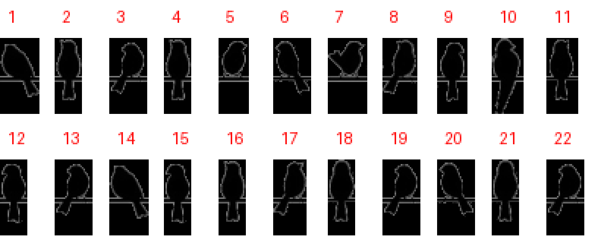

# Con chim non

**Category:** Crypto

## Đề bài

> Con chim non trên cành hoa / Hót véo von, hót véo von / Em yêu chim, em mến chim / Vì mỗi lần chim hót em vui
>
> Format: `miniCTF{Viết_thường_ngăn_cách_nhau}`

Đề cho 22 ảnh, mỗi ảnh là một con chim đậu trên dây điện (xem [`files/`](./files/)):



## Giải

Đây là **Birds on a Wire cipher**: mỗi chữ cái ứng với một con chim, phân biệt bằng hướng đầu và vị trí đuôi. Dùng bảng mã tại [dCode](https://www.dcode.fr/birds-on-a-wire-cipher) hoặc [Geocaching Toolbox](https://www.geocachingtoolbox.com/index.php?lang=en&page=codeTables&id=birdsOnAWire), so khớp từng con chim bằng mắt, ta được:

```
minictfbexuanmailonton
```

Tức là *bé Xuân Mai lon ton*.

## Flag

```
miniCTF{be_xuan_mai_lon_ton}
```
