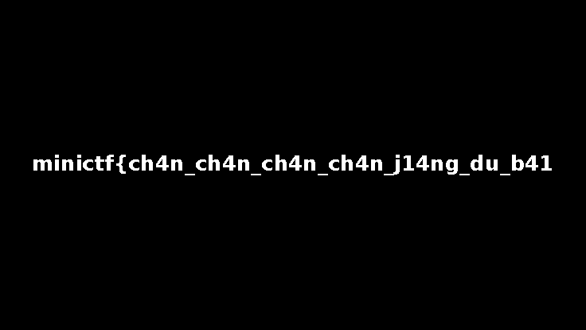
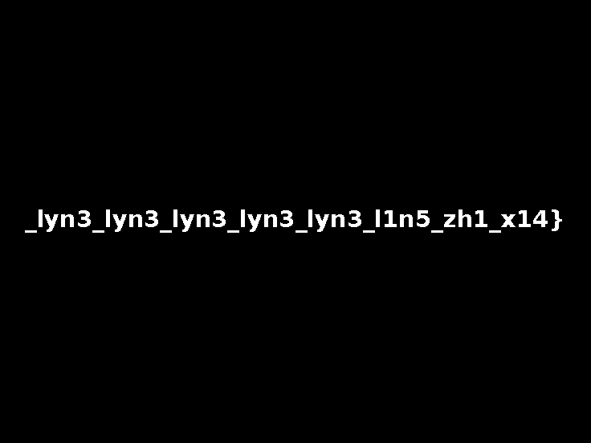

# Chan chan chan

**Category:** Forensics

## Đề bài

File đề: [`files/chan.txt`](./files/chan.txt), là một chuỗi hex rất dài bắt đầu bằng `89 50 4e 47`, tức là **hex dump của một ảnh PNG**.

## Bước 1: Tách các lớp

Đổi hex ra binary được `chan.png` (736×414):


Duyệt các chunk PNG:

- `tEXt` Comment chứa `minictf{ch4n_ch4n_ch4n_ch4n_ch4n_t0_d1}`. Đây là **decoy**.
- Sau `IEND` vẫn còn dữ liệu: **một file zip** và **một PNG thứ hai**.

File zip có 2 file:

- `notes.txt`: *"Transport layer. Decode Base64 to get the second picture. Inspect RGB channels / bit planes."*
- `img_payload.txt`: một chuỗi Base64. Decode ra ảnh `preview.png` (736×552).


PNG thứ hai nằm sau zip là ảnh sọc xám. RGB-LSB của ảnh này chứa `minictf{D0_y0u_w4n7_70_h4v3_4_g3n1u5_g1rlfr13nd}`, cũng là **decoy**.

## Bước 2: Bit plane

Làm theo gợi ý *"Inspect RGB channels / bit planes"* và xem tỉ lệ bit 1 của từng bit plane. Bit plane bình thường có khoảng 50% bit 1, nhưng có 2 plane gần như toàn 0:

| Ảnh | Plane | Tỉ lệ bit 1 |
|---|---|---|
| `chan.png` | Red bit 0 | 1.7% |
| `preview.png` | Green bit 0 | 1.4% |

Hai plane này không chứa dữ liệu nhị phân mà là **chữ được vẽ thẳng vào ảnh**.

**`chan.png` – Red bit 0** cho nửa đầu:



**`preview.png` – Green bit 0** cho nửa sau:



Script: [`solve.py`](./solve.py) tách tất cả các lớp, in ra 2 decoy và lưu 2 ảnh bit plane ở trên.

## Flag

```
minictf{ch4n_ch4n_ch4n_ch4n_j14ng_du_b41_lyn3_lyn3_lyn3_lyn3_lyn3_l1n5_zh1_x14}
```
