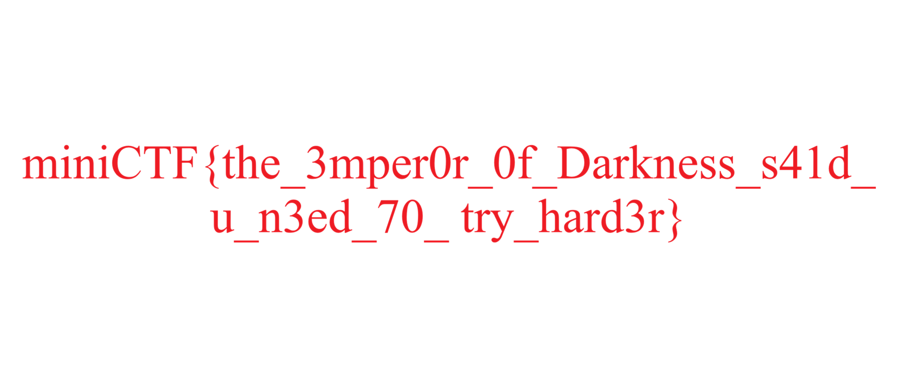
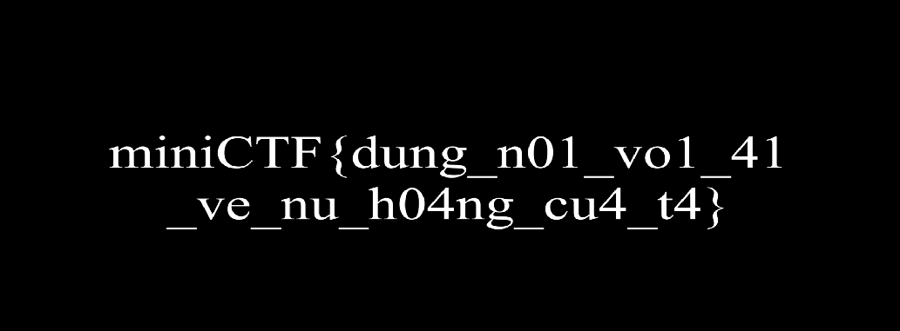

# Emperor of Darkness

**Category:** Forensics

## Đề bài

> chú đi qua và lướt thấy hoang de bong toi lén gửi một thứ gì cho ai đó nên đã tạo bản sao tìm xem hắn đang giấu diếm cái gì

File đề: `Emperor of Darkness.pcap` (~600 MB, không đưa lên repo vì vượt giới hạn 100 MB của GitHub).

## Bước 1: Lọc nhiễu

**Statistics → Protocol Hierarchy / Conversations** trong Wireshark cho thấy phần lớn dung lượng là nhiễu:

| Traffic | Nội dung |
|---|---|
| TCP 9000 (~588 MB) | Một khối random 152 KB lặp lại hàng nghìn lần |
| TCP 22 (SSH) | Dữ liệu mã hoá |
| ICMP (68k gói), UDP | Payload ghi rõ `ICMP-NOISE`, `UDP-NOISE` |
| **HTTP port 80** | 3 file: `hoangdebongtoi.jpg`, `chall.png`, `blue_sky.docx` |
| **HTTP port 8080** | 10 response, mỗi cái ~3.5 KB Base64 |

## Bước 2: HTTP port 80 (decoy)

**File → Export Objects → HTTP** lấy ra `chall.png`, nhưng ảnh này chỉ là lời trêu:



> `miniCTF{the_3mper0r_0f_Darkness_s41d_u_n3ed_70_try_hard3r}`: "Hoàng đế bóng tối bảo bạn cần cố gắng hơn".

## Bước 3: HTTP port 8080, ghép PNG

Server Python SimpleHTTP ở port 8080 trả về 10 lần, mỗi lần một **mảnh Base64**. Ghép 10 mảnh theo thứ tự request rồi decode ra một **PNG** 1033×381 (CRC của mọi chunk đều hợp lệ):



Chữ trong ảnh, `miniCTF{dung_n01_vo1_41_ve_nu_h04ng_cu4_t4}`, là **decoy**, nộp sẽ báo sai.

## Bước 4: Metadata

Chạy `exiftool -a -u port8080.png` (hoặc đọc thẳng các chunk):

- `tEXt` Comment: `miniCTF{chuc_mun9_b4n_h0c_du0c_cach_dung_exiftool}`. Đây là **decoy** ("chúc mừng bạn học được cách dùng exiftool").
- `eXIf` → `UserComment`: `NVUW42KDKRDHWQ2IKVBV6TKVJY4V6VCIGRHDSX2MGBHH2===`

Chuỗi `UserComment` chỉ gồm `A–Z`, `2–7` và kết thúc bằng `===`, tức là **Base32**. Decode ra flag thật.

Script (cần `tshark`): [`solve.py`](./solve.py)

```
[decoy] tEXt Comment: miniCTF{chuc_mun9_b4n_h0c_du0c_cach_dung_exiftool}
UserComment: NVUW42KDKRDHWQ2IKVBV6TKVJY4V6VCIGRHDSX2MGBHH2===
flag: miniCTF{CHUC_MUN9_TH4N9_L0N}
```

## Flag

```
miniCTF{CHUC_MUN9_TH4N9_L0N}
```
