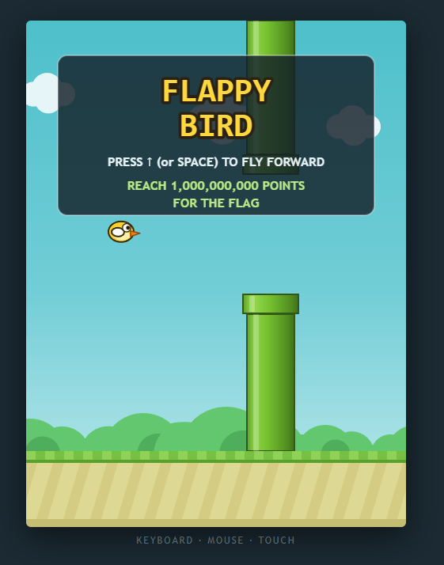
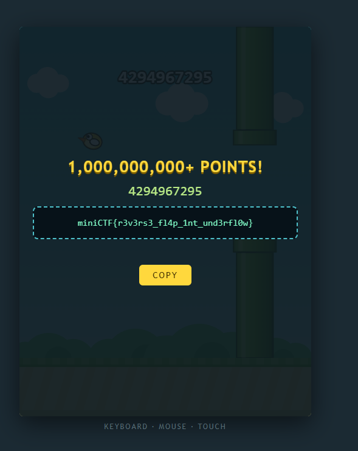

# Flappy Bird

**Category:** Misc

## Đề bài

Một game Flappy Bird trên web, yêu cầu đạt **1,000,000,000+ điểm** để nhận flag.



## Phân tích

Chơi thật lên 1 tỷ điểm là không khả thi, nên yêu cầu này chỉ để đánh lạc hướng. Màn hình hướng dẫn chỉ nhắc tới phím `↑` (hoặc `Space`) để bay tới, nhưng game còn nhận cả phím `↓`, và phím này khiến con chim **bay ngược lại**.

Khi bay ngược qua ống, điểm bị **trừ** thay vì cộng. Điểm đang là `0` mà bị trừ đi 1 sẽ thành `-1`. Do điểm được lưu dưới dạng số nguyên **không dấu 32-bit**, giá trị này bị tràn (integer underflow) và quay vòng về giá trị lớn nhất:

```
0 - 1 = -1  →  (uint32) 0xFFFFFFFF = 4294967295
```

`4294967295 ≥ 1,000,000,000`, nên điều kiện nhận flag được thỏa mãn.

## Khai thác

1. Vào game, bấm phím `↓` để chim bay ngược về phía sau.
2. Cho chim bay ngược qua một ống, điểm bị underflow thành `4294967295`.
3. Game hiện thông báo **1,000,000,000+ POINTS!** kèm flag.



## Flag

```
miniCTF{r3v3rs3_fl4p_1nt_und3rfl0w}
```
