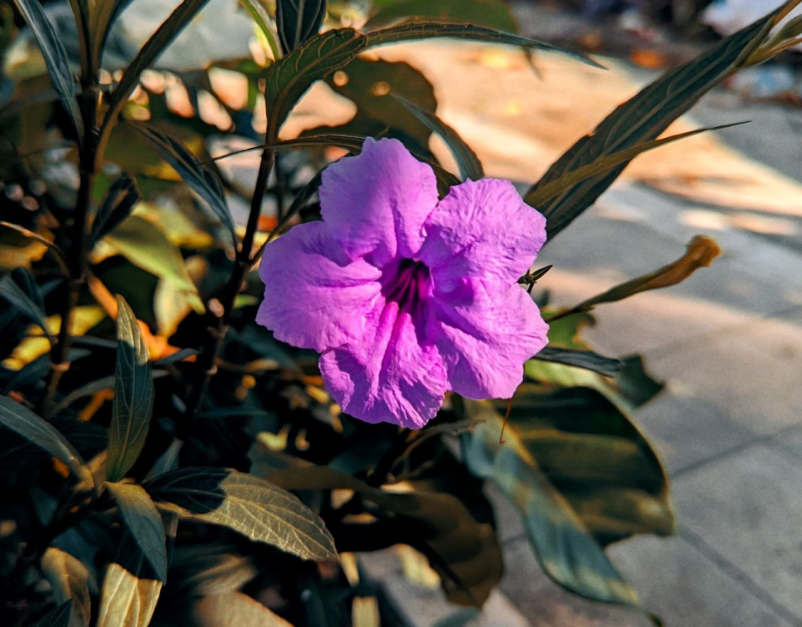

# Máy ảnh kì lạ

**Category:** Misc

## Đề bài

> một chiếc máy ảnh kì lạ h41N90n được ở nhà 3T, có giấu gì bên trong không nhỉ??

Đề cho các file sau (xem thư mục [`files/`](./files/)):

| File | Mô tả |
|---|---|
| `chall` | ELF 64-bit Linux, không bị strip |
| `data.bin` | Dữ liệu đã mã hoá, header `FLWRDAT1`, bên trong là một file `.png` |
| `fake_source.cpp` | Source "giả": có đủ phần kiểm tra key nhưng không có hàm `decrypt_image` |
| `README.txt` | Mô tả đề |

## Bước 1: Đọc source và tìm key

Trong `fake_source.cpp`, chương trình nhận một key 16 ký tự rồi chạy qua `decode_key`. Sau đó nó so sánh SHA-256 của key đã decode với một hash cố định:

```cpp
constexpr Hash256 EXPECTED_KEY_HASH = {
    0x17,0xd4,0x55,0xf9, ... ,0x7f,0xd1
};
```

```
17d455f9c7e19015861d996f0b88489f3ed8be71279239f4a946f686ac317fd1
```

Brute-force SHA-256 không khả thi, nên ta thử tra hash này trên các trang tra hash online (CrackStation, hashes.com...). Kết quả:

```
17d455f9...7fd1    sha256    beautifulflowers
```

Tuy vậy, `beautifulflowers` mới là key **sau khi decode**, chưa phải key cần nhập vào chương trình.

## Bước 2: Đảo ngược `decode_key`

```cpp
for (i = 0; i < 16; ++i) {
    bytes[i] = rotate_right(bytes[i], (i % 7) + 1);
    bytes[i] ^= XOR_MASK[i % 5];              // {0xdb,0xef,0x3d,0x41,0xa1}
    bytes[i] -= (i * 3 + 7);
}
std::reverse(bytes.begin(), bytes.end());
```

Cả 4 phép biến đổi đều đảo ngược được. Ta làm ngược lại theo thứ tự ngược:

1. Lật ngược chuỗi `beautifulflowers`.
2. Với mỗi byte ở vị trí `i`: cộng `i*3+7`, XOR với `XOR_MASK[i%5]`, rồi xoay trái `(i%7)+1` bit.

```
input key = CNzldVHkWIUnggn5
```

## Bước 3: Giải mã ảnh

Hàm `decrypt_image` bị cắt khỏi source. Disassemble binary thì thấy nó gồm khá nhiều lớp: `chacha20_xor`, `derive_image_key`, `extra_stream_xor`, `make_permutation` (splitmix64), `chain_decrypt`, `local_decrypt` và `unpack_image`. Không cần viết lại những hàm này, vì đã có key đúng thì chỉ việc **chạy thẳng binary** (trên Linux hoặc WSL):

```
$ ./chall CNzldVHkWIUnggn5 data.bin recovered.png
Correct key!
Image restored: recovered.png
```



Ảnh là một bông hoa, không có flag nhìn thấy được. Ảnh cũng không có chunk lạ hay dữ liệu thừa sau `IEND`.

## Bước 4: LSB steganography

Quét các bit plane của ảnh (giống cách `zsteg` làm) thì thấy **LSB kênh Blue**, đọc theo từng hàng với MSB first, bắt đầu bằng một header rõ ràng:

```
4c 53 42 31 | 00 00 00 1d | 6d 69 6e 69 43 54 46 7b ...
 L  S  B  1 |  length=29  |  m  i  n  i  C  T  F  { ...
```

Đọc 29 byte sau header là ra flag.

Script đầy đủ: [`solve.py`](./solve.py)

```
$ python solve.py
input key: CNzldVHkWIUnggn5
flag: miniCTF{B34ut1ful_Fl0W3r!!!!}
```

## Flag

```
miniCTF{B34ut1ful_Fl0W3r!!!!}
```
