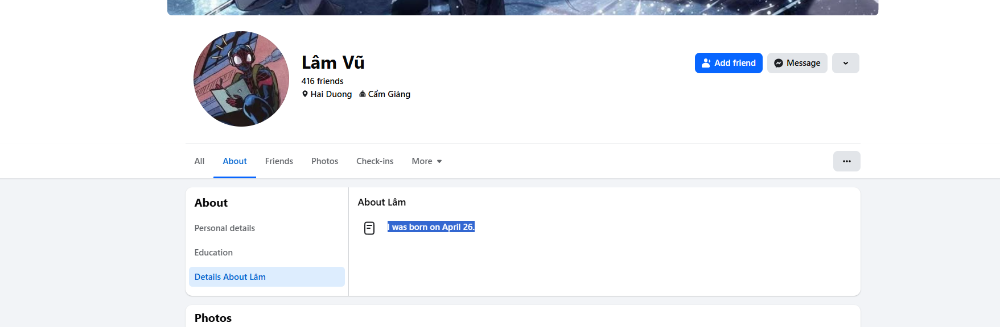
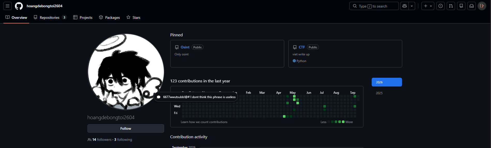
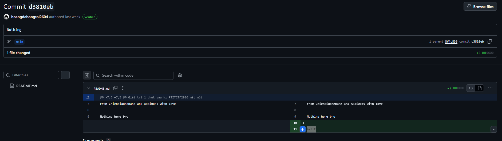
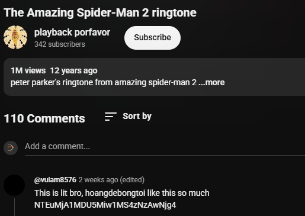
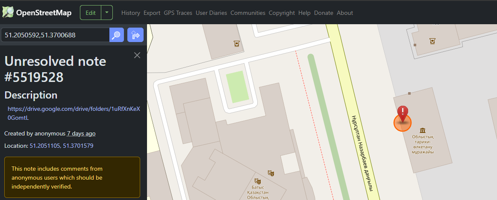

# Hidden things

**Category:** OSINT

## Đề bài

> Hoangdebongtoi, 1 member trong ISP đã giấu thứ gì đó trên ispclub.vn, hãy vào trang cá nhân của anh ấy để điều tra.

Trang cá nhân: `https://ispclub.vn/isper/hoangdebongtoi`

## Tầng 1 — StegZero trong bio

`bio` (API `https://ispclub.vn/api/profile/hoangdebongtoi`) dài 1024 ký tự, trong đó **664 ký tự zero-width** thuộc **8 codepoint** (`U+200B/C/D`, `U+2060/2062/2063/2064`, `U+FEFF`) → **3 bit/ký tự**, đúng alphabet của **[StegZero](https://stegzero.com/)** (Standard). Header: magic `A55A`, version `1`, nonce `0x4001`, len `238`, CRC32 `0x1899A92A`.

**Message bị XOR với passphrase.** Header ghi version 1 (theo spec là frame không bảo vệ), nhưng engine vẫn nhận passphrase tuỳ chọn ở version 1 — nên **phải lấy passphrase ở Tầng 2 trước mới decode được bio**. Lưu ý CRC32 là CRC của message *sau* khi XOR, nên **CRC khớp không có nghĩa là decode xong**; dấu hiệu thiếu khoá là bước decode UTF-8 thất bại.

XOR 238 byte với passphrase `6677wwutsubb!@#` ra:

> Chúc mừng thám tử nhí đã tìm ra tôi :> Hoangdebongtoi đã để lại 1 message nữa với 6 ký tự như sau `7ZIs2s`, liệu bạn có thể tìm ra ý nghĩa của chúng ? Có vẻ vẫn còn thiếu gì đó thì phải.

Bio cũng có gợi ý GitHub: username = `hoangdebongtoi` + ngày sinh (DDMM).

## Tầng 2 — GitHub

Ngày sinh **26/4** → GitHub [`hoangdebongtoi2604`](https://github.com/hoangdebongtoi2604).



Profile công khai chuỗi **`6677wwutsubb!@#`** — **passphrase để decode StegZero ở Tầng 1**. Vậy thứ tự giải là: đọc bio → lên GitHub lấy passphrase → quay lại decode bio.



Trong repo `Does-this-repo-have-any-value-`, commit **`d3810eb`** (message "Nothing") thêm dòng **`AeKiE`**:



## Tầng 3 — YouTube

Ghép 2 mảnh: `7ZIs2s` (bio) + `AeKiE` (commit) = **`7ZIs2sAeKiE`** — đúng **11 ký tự = YouTube video ID**:

`https://youtu.be/7ZIs2sAeKiE` ("The Amazing Spider-Man 2 ringtone")

Comment của `@vulam8576` chứa một chuỗi Base64:



```
NTEuMjA1MDU5Miw1MS4zNzAwNjg4  →  51.2050592,51.3700688
```

Đây là **toạ độ địa lý**.

## Tầng 4 — OpenStreetMap

Tra toạ độ `51.2050592, 51.3700688` (gần Oral, Kazakhstan) trên OpenStreetMap, tìm thấy một **note** chứa link Google Drive:



Folder Drive: `1uRfXnKeXvsYLQnIoVCxKwwH1X-0GomtL`

## Tầng 5 — Google Drive → Minecraft

Folder Drive chứa:

- `1.21.11.zip` — một **world Minecraft** (tên `Osint`, phiên bản 1.21.11).
- `Xin chào thiên tày osint.docx` — hướng dẫn: tải world vào launcher, chọn bản 1.21.11, và tìm thứ được giấu bên trong.

## Chuỗi OSINT tổng quát

```
ISP profile (bio)
  ├─ gợi ý: GitHub = hoangdebongtoi + ngày sinh (DDMM)
  └─ GitHub hoangdebongtoi2604
       ├─ passphrase 6677wwutsubb!@#  ──┐ (quay lại decode bio)
       └─ commit d3810eb  →  AeKiE      │
  ┌─────────────────────────────────────┘
  └─ StegZero(bio, passphrase)  →  7ZIs2s

7ZIs2s + AeKiE = 7ZIs2sAeKiE → YouTube → toạ độ → OSM note → Google Drive
  → world Minecraft "Osint"  →  decode rương  →  flag
```

Tầng 1 và Tầng 2 **phụ thuộc vòng**: bio gợi ý tìm GitHub, nhưng bio chỉ decode được sau khi lấy passphrase từ GitHub.

## Tầng cuối — Minecraft

Tải world vào Minecraft 1.21.11. Sách của `ronah207` gần điểm spawn nói trong thế giới giấu **khoảng 20 chiếc rương, chỉ 1 chiếc chứa thứ cần tìm**, còn lại là decoy. Thực tế world có **1.674 container** và **120 tờ giấy có `custom_name`** — phần lớn là decoy.

## Flag

```
miniCTF{m1n3craft_1s_myst3r1ous_4s_sh1t}
```

Flag nằm trong **2 rương** ở 2 vùng khác nhau, encode khác nhau:

| Toạ độ | Rương | Payload thô | Encode |
|---|---|---|---|
| `(-98, 79, 147)` | `r.-1.0.mca` slot 23 | `bWluaUNURnttMW4zY3JhZnRfMXNfbXlzdDNyMW91c180c19zaDF0fQ==` | Base64 |
| `(72, -24, -99)` | `r.0.-1.mca` slot 0 | `` ZE0?4LsUk4Z82^$V{&0;bYC%ZUu}7FbTe`>Z*_BDG;?2bXfbqs `` | Base85 |

Cả hai đều decode ra đúng flag trên. Đây là **flag duy nhất xuất hiện 2 lần** trong world, và cũng là flag duy nhất đúng chủ đề challenge.

