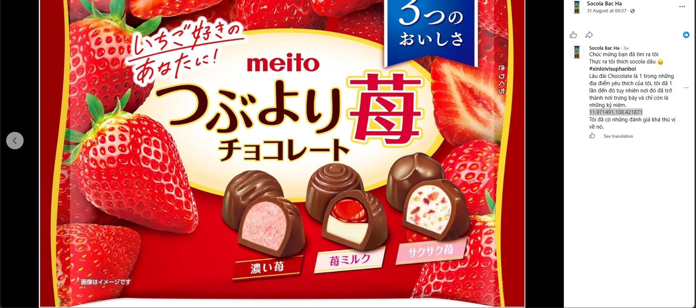
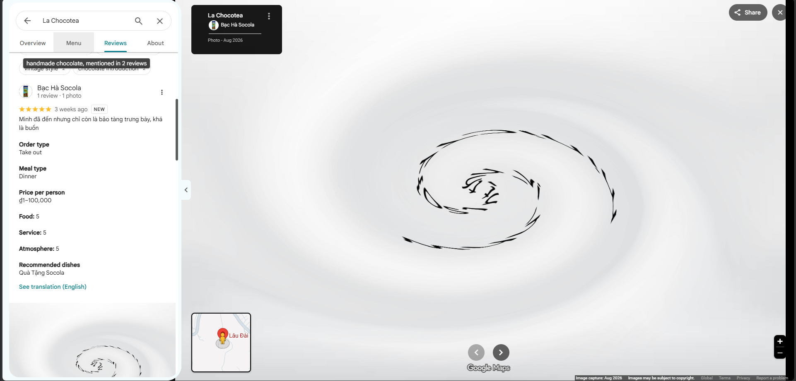
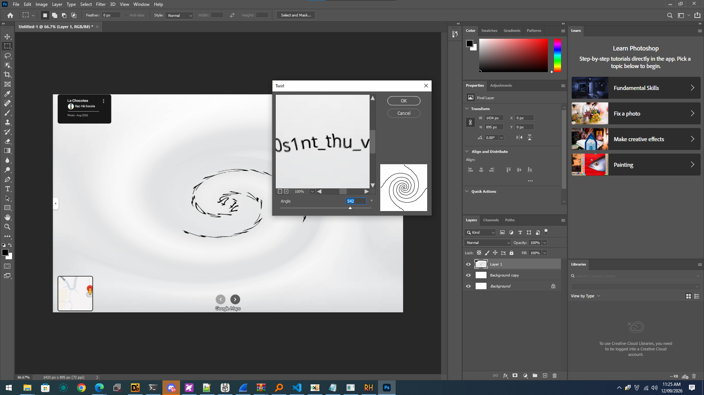
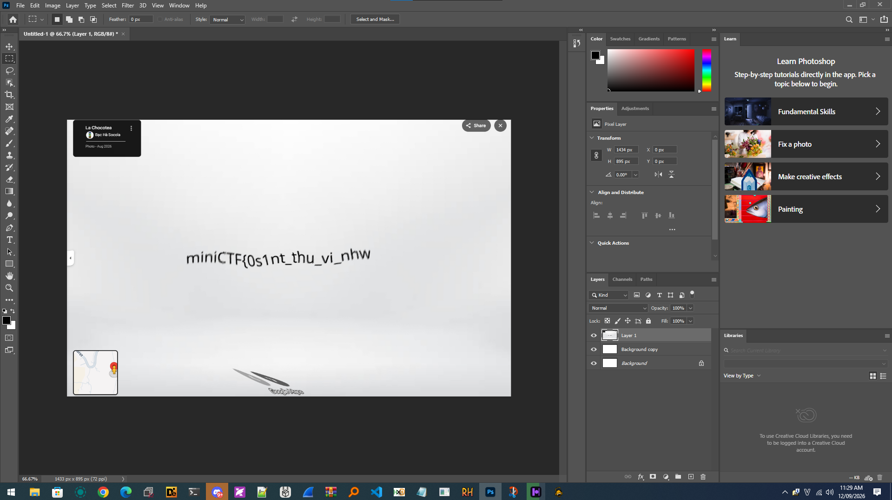

# Socola Bạc Hà

**Category:** OSINT

## Đề bài

> Người dùng facebook với username `socolabachaptit` đang giấu thứ gì đó trong facebook của anh ấy. Hãy thử tìm hiểu xem

## Nửa sau của flag: Bio Facebook

Vào Facebook `socolabachaptit`, phần **bio** có sẵn nửa sau của flag:

```
_soc0la_bac_ha}
```

## Nửa đầu của flag: Google Maps review

Lục trong **Albums**, dưới một ảnh socola dâu có comment của chính anh ấy:




> Chúc mừng bạn đã tìm ra tôi
> Thực ra tôi thích socola dâu 🙁
> #xinloivisuphanboi
> Lâu đài Chocolate là 1 trong những địa điểm yêu thích của tôi, tôi đã 1 lần đến đó tuy nhiên nơi đó đã trở thành nơi trưng bày và chỉ còn là những kỷ niệm.
> `11.971491,108.421871`
> Tôi đã có những đánh giá khá thú vị về nó.

Tra toạ độ `11.971491,108.421871` trên Google Maps ra địa điểm **La Chocotea** (Lâu đài Chocolate). Trong phần **Reviews** có review của tài khoản *Bạc Hà Socola*, kèm một ảnh nền trắng với hình xoắn ốc, tức là chữ đã bị làm méo bằng hiệu ứng **Twirl**:



Mở ảnh trong Photoshop, vào **Filter → Distort → Twirl** và chỉnh góc (khoảng 542°) để xoắn ngược lại:



Chữ hiện ra rõ ràng:



```
miniCTF{0s1nt_thu_vi_nhw
```

## Flag

Ghép 2 nửa lại:

```
miniCTF{0s1nt_thu_vi_nhw_soc0la_bac_ha}
```
